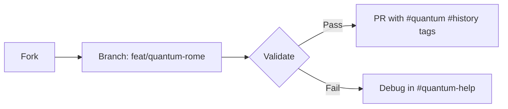

```markdown
# 🌌 Contributing to Psychohistory-System

*"History is a quantum probability landscape—your contributions collapse it into sharper focus."*

## 🛠️ How to Contribute

### 1. 📥 Setup Your Environment
```bash
git clone https://github.com/Saranoah/Psychohistory-System.git
cd Psychohistory-System
conda env create -f environment.yml  # Includes Qiskit, TensorFlow, and historical datasets
conda activate psychohistory
```

### 2. 📌 Contribution Types

#### 🧠 **Conceptual Contributions**
- **New Case Studies**:  
  - Example: `quantum_rome/` analyzing Roman collapse as decoherence  
  - Required:  
    - Superposition state definitions  
    - Uncertainty quantification matrices  
    - Feedback loop diagrams (see `docs/feedback_template.md`)

#### 💻 **Code Contributions**
- **Quantum Kernels**:  
  ```python
  class QuantumHistoryKernel(QuantumAlgorithm):
      """Applies Grover's algorithm to historical counterfactuals"""
      def __init__(self, n_qubits=4):
          self.n_qubits = n_qubits  # 4 qubits = 16 historical states
  ```
- **Visualizations**:  
  - Bloch sphere representations of civilizational states  
  - Entanglement network graphs (use `networkx` + `qiskit.visualization`)

#### 📊 **Data Standards**
- Historical datasets require:  
  - `uncertainty` columns (e.g., `"roman_stability_std"`)  
  - `entanglement` fields documenting cross-civilization links  
  ```csv
  year,stability_mean,stability_std,entangled_with
  476,0.32,0.12,"Byzantium"
  ```

### 3. 🔄 Workflow


### 4. 🧪 Validation Suite
Run before PR:
```bash
pytest tests/  # Includes quantum state normalization checks
python -m psychohistory.validate --case-study edo_japan
```

### 5. 🧩 Code Conventions
- **Quantum Variables**: Use bra-ket notation in docstrings:  
  ```python
  def measure_collapse(state: QuantumState) -> ProbabilisticOutcome:
      """
      Args:
          |state⟩: e.g., a|Stable⟩ + b|Revolution⟩
      """
  ```
- **Historical Terms**: Tag with `#psychohistory` for cross-reference:  
  ```python
  sankin_kotai = True  # #psychohistory #control_system
  ```

### 6. 📜 Review Process
- **Phase 1**: Automated checks (quantum unit tests, uncertainty validation)  
- **Phase 2**: Human review by:  
  - 1 historian (fact-checking)  
  - 1 quantum physicist (state logic)  
  - 1 AI engineer (model integration)  

### 7. 🚀 Quickstart Contributions
- **Beginner**: Add metadata to `datasets/byzantium.csv`  
- **Intermediate**: Visualize Edo Japan's superposition collapse  
- **Advanced**: Implement HHL algorithm for historical inversion problems  

---

✨ **Pro Tip**: For controversial historical events (e.g., "Was the Bronze Age collapse quantum-mechanical?"), open a **Discussion Thread** tagged #quantum_debate.

> *"The past isn't dead—it's in a superposition of interpretations."*
```

