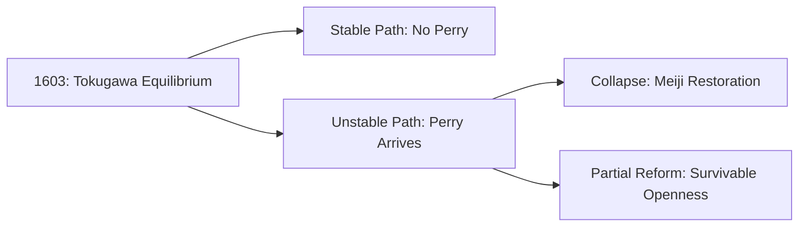

 **Edo Period’s 250-Year Peace** as a **psychohistory case study** for your repository, blending historical analysis with quantum-inspired AGI frameworks:

---

### **Case Study Template: "The Tokugawa Equilibrium – A Psychohistory of Forced Peace"**
#### **1. Abstract**  
- **Objective**: Analyze Edo Japan (1603–1868) through psychohistorical lenses (quantum stability states, feedback loops, collapse triggers).  
- **Key Question**: *Can rigidly engineered peace be sustained indefinitely, or does it create latent instability?*  

---

#### **2. Quantum-Inspired Civilizational States**  
Model Edo Japan as a **superposition of stability vectors**:  
- **State Vectors**:  
  - `|Stable⟩`: Authoritarian control + cultural cohesion.  
  - `|Fragile⟩`: Economic stagnation + technological freeze.  
  - `|Entangled⟩`: Daimyo-Shogunate power balance (measured via *sankin-kōtai*).  
- **Collapse Probability**:  
  - Calculated via *decoherence* from external shocks (Perry’s ships as "measurement").  

```python  
# Pseudocode for Edo's quantum state collapse  
def edo_collapse(internal_stress, external_force):  
    coherence = 1 - (internal_stress + external_force)  
    return "Meiji Restoration" if coherence < 0.3 else "Tokugawa Equilibrium"  
```

---

#### **3. Feedback Loops & Control Mechanisms**  
| **Mechanism**       | **Stabilizing Effect**               | **Unintended Consequences**        |  
|---------------------|--------------------------------------|------------------------------------|  
| Sankin-kōtai        | Drained daimyo wealth → No rebellion | Samurai debt → Class resentment    |  
| Sakoku (Isolation)  | Blocked colonial interference        | Technological stagnation           |  
| Neo-Confucianism    | Enforced social order                | Suppressed innovation              |  

**AGI Parallel**:  
- Like an **overfitted ML model**, Edo Japan optimized for *training data* (internal peace) but failed on *out-of-distribution* inputs (steamships).  

---

#### **4. Uncertainty Quantification**  
- **Epistemic Uncertainty**: Shogunate’s ignorance of Industrial Revolution.  
- **Aleatoric Uncertainty**: Black Swan event (Perry’s arrival).  
- **Measurement Impact**: *Merely observing foreign tech* triggered rebellion (cf. quantum observer effect).  

**Equation**:  
\[
\text{Total Fragility} = \sqrt{(\text{Stagnation}^2 + \text{Isolation}^2)}  
\]

---

#### **5. Scenario Tree (Branching Timelines)**  


---

#### **6. Lessons for AGI Psychohistory**  
- **Stability ≠ Resilience**: Edo’s peace was a *local optimum* vulnerable to gradient shocks.  
- **Adaptive Control**: Modern systems need *feedback dampeners* (e.g., AI-driven dynamic governance).  
- **Quantum Warning**: Over-engineering superpositions (rigid class systems) risks catastrophic collapse.  

---

#### **7. Repository Files**  
1. **/data/edo_metrics.csv**:  
   - Columns: `Year, GDP_Estimate, Samurai_Discontent, Foreign_Contact_Level`.  
2. **/models/tokugawa_simulator.py**:  
   - Agent-based model of daimyo decision-making under sankin-kōtai.  
3. **/visuals/quantum_collapse.ipynb**:  
   - Matplotlib animation of Perry’s "measurement" collapsing Edo’s state vector.  

---

#### **8. Presentation Hook**  
> *"The Tokugawa shogunate was a *classical* system trying to exist in a *quantum* world—until America collapsed its wavefunction. How do we prevent our AI-aligned civilizations from suffering the same fate?"*  

--- 

